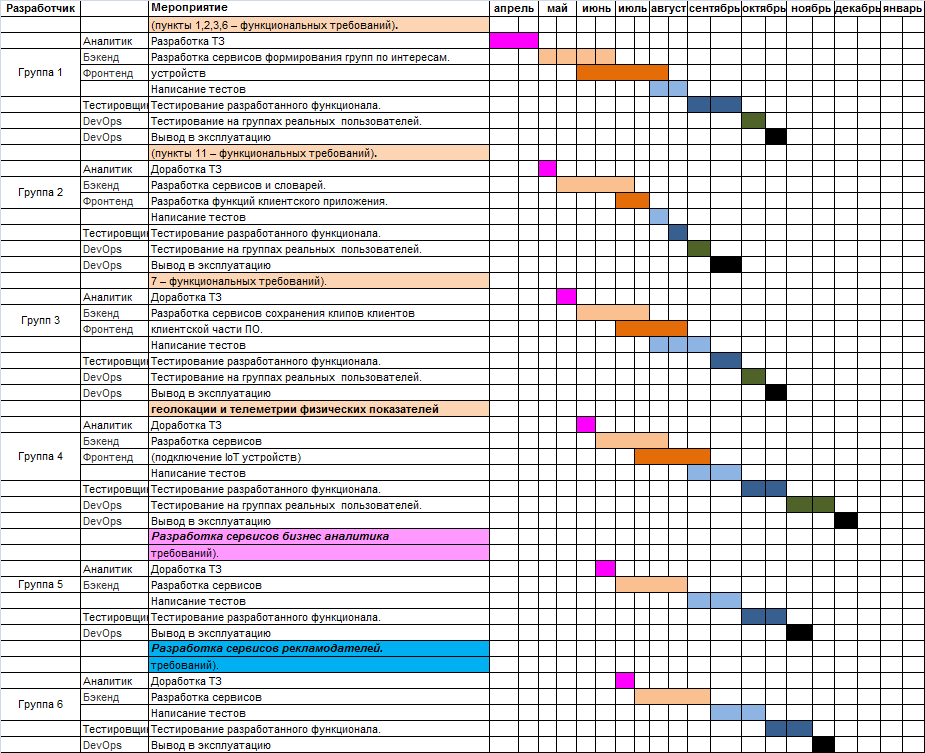

### 6 План поэтапной разработки и расширения системы, анализ критически важных компонентов.

| №  пп     | Мероприятия                                                  |
| --------- | ------------------------------------------------------------ |
|           |                                                              |
| ***1.\*** | ***Разработка  клиентских функций системы.\***               |
| **1.1**   | **Разработка функций формирования групп по интересам** (пункты 1,2,3,6 – функциональных требований)**.** |
| 1.1.1     | Разработка ТЗ                                                |
| 1.1.2     | Разработка сервисов формирования  групп по интересам.        |
| 1.1.3     | Разработка клиентского приложения  для мобильных устройств. С сервисами формирования групп. |
| 1.1.4     | Разработка клиентского приложения  для стационарных устройств. |
| 1.1.5     | Написание тестов                                             |
| 1.1.6     | Тестирование разработанного  функционала.                    |
| 1.1.7     | Тестирование на группах  реальных пользователей.             |
| 1.1.8     | Вывод в эксплуатацию.                                        |
|           |                                                              |
| **1.2**   | **Разработка функций языковой локализации системы** (пункты 11 – функциональных требований)**.** |
| 1.2.1     | Разработка ТЗ                                                |
| 1.2.2     | Разработка сервисов и словарей.                              |
| 1.2.3     | Разработка функций клиентского  приложения.                  |
| 1.2.4     | Написание тестов                                             |
| 1.2.5     | Тестирование разработанного  функционала.                    |
| 1.2.6     | Тестирование на группах  реальных пользователей.             |
| 1.2.7     | Вывод в эксплуатацию.                                        |
|           |                                                              |
| **1.3**   | **Разработка функций работы с клипами клиентов** (пункты 5а, 7 – функциональных требований). |
| 1.3.1     | Разработка ТЗ                                                |
| 1.3.2     | Разработка сервисов сохранения  клипов клиентов.             |
| 1.3.3     | Разработка функций формирования  клипов пользователей в клиентской части ПО. |
| 1.3.4     | Написание тестов                                             |
| 1.3.5     | Тестирование разработанного  функционала.                    |
| 1.3.6     | Тестирование на группах  реальных пользователей.             |
| 1.3.7     | Вывод в эксплуатацию.                                        |
|           |                                                              |
| **1.4**   | **Разработка функций работы с формированием данных геолокации и  телеметрии физических показателей организма,**   (пункты 4, 5б-е  – функциональных требований). |
| 1.4.1     | Разработка ТЗ                                                |
| 1.4.2     | Разработка сервисов.                                         |
| 1.4.3     | Разработка функций пользователей в  клиентской части ПО (подключение IoT устройств). |
| 1.4.4     | Написание тестов                                             |
| 1.4.5     | Тестирование разработанного  функционала.                    |
| 1.4.6     | Тестирование на группах  реальных пользователей.             |
| 1.4.7     | Вывод в эксплуатацию.                                        |
|           |                                                              |
| ***2.\*** | ***Разработка  сервисов аналитика.\***                       |
| **2.1**   | **Разработка функций .** (пункты  9, 10 –  функциональных требований). |
| 2.1.1     | Разработка ТЗ                                                |
| 2.1.2     | Разработка сервисов.                                         |
| 2.1.3     | Написание тестов                                             |
| 2.1.4     | Тестирование разработанного  функционала.                    |
| 2.1.5     | Вывод в эксплуатацию.                                        |
|           |                                                              |
| ***3.\*** | ***Разработка  сервисов рекламодателей.\***                  |
| **3.1**   | **Разработка функций** (пункты 8 –  функциональных требований). |
| 3.1.1     | Разработка ТЗ                                                |
| 3.1.2     | Разработка сервисов.                                         |
| 3.1.3     | Написание тестов                                             |
| 3.1.4     | Тестирование разработанного функционала.                     |
| 3.1.5     | Тестирование на группах  реальных пользователей.             |
| 3.1.6     | Вывод в эксплуатацию.                                        |

#### Критически важные компоненты системы:

1. ##### Витрина – демонстрация нашего продукта.

​			a.  Получение информации о нашем продукте.

2. ##### Система регистрации и аутентификации.

​			a.  Получение прав доступа и регистрация новых клиентов

​			b.  Контроль черного списка.

3. ##### Домен заказ 

​			a.  Получение коммерческого результата компании.

4. ##### Система хранения данных

​			a.  Хранение пользовательских данных.

​			b.  Хранение коммерческих данных.

