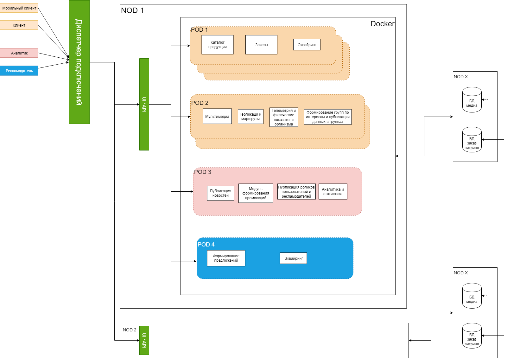

### 10  Анализ и описание архитектурных опций и обоснование выбора.

 

| Категория                           | Детали                                                       |
| ----------------------------------- | ------------------------------------------------------------ |
| Цель проектирования                 | Максимальный  охват населения и привлечение к спортивной деятельности.  Формирование  такого образа бренда в глазах участников, который позволит нашим товарам  оставаться в фаворитах при выборе из прочих равных. |
| Бизнес  - цели                      | файл  - 001.Бизнес цели                                      |
| Основные  функциональные требования | Файл - 002 Функциональные требования.                        |
| Стейкхолдеров                       | Файл - 003 Стейкхолдеров и их интересы                       |
| Концептуальная  архитектура         | Файл - 004 Концептуальная архитектура                        |
| Риски                               | Файл - 005 Описание рисков реализации                        |
| План  разработки                    | Файл - 006 План поэтапной разработки и расширения  системы, анализ критически важных компонентов |
| Критические  бизнес-сценари         | Файл - 007 Критические бизнес-сценари                        |
| Атрибуты качества                   | Файл  - 008 Атрибуты качества.                               |
| Ограничения                         | Файл - 009 Анализ и список нефункциональных  требований.     |
|                                     |                                                              |
| **Архитектурные задачи**            | Разработать  микросервисное облачное приложение на основании функциональных требований командой  собственных разработчиков. |

| **Решение**                          | **Описание**                                                 |
| ------------------------------------ | ------------------------------------------------------------ |
| Архитектурный  стиль - Microservices | Выделим 3 основных процесса:   1.    Клиент   2.    Бизнес аналитик   3.    Рекламодатель   Бизнес процессы описаны в  файле – 007 Критические бизнес-сценари  Критические бизнес процессы  помечены на схеме песочным цветом.      1.    Для выполнения требований защиты персональных данных:  Хранение персональных данных  производим на устройстве клиента. (От строки ‘login’+’password’ берем хеш, хеш сопоставляем  идентификатору (id). Все остальные действия ведем относительно id. При смене ‘login’ или ’password’ меняем привязку хеш - id).   2.    Для размещения системы используем региональных провайдеров облаков.  NOD 1 – типовой докер  для размещения у региональных провайдеров.  NOD X – система хранения данных  имеет доменную структуру. Домен «Заказ» хранит локальные данные, а также  дублирует данные в центральное хранилище. Домен «Витрина» имею систему  синхронизации данных с центральным хранилищем.  NOD 2 – подобен NOD 1 только в  другой локации. Система хранения данных аналогична NOD X.  Клиентские данные (геолокация,  тренировки, ролики…) хранятся в локальных хранилищах, возможна передача  данных по запросу клиента (просмотр роликов, планов тренировок..).   Центральным хранилищем  определяется одна из NOD X с удобной локацией для головного отделения  компании.   3.    Диспетчер подключения – единая точка входа. Диспетчер подключений  переключает клиента в его локацию. Возможен выбор локации в настройках  клиентского приложения.   4.    POD 1 - наиболее нагруженный  элемент схемы. Это клиентская часть работает на основной бизнес процесс,  предлагается оркестрация данного элемента.   5.    POD 2 – возможны не меньшие  нагрузки данного пода, при передаче и просмотре роликов пользователей. Под  менее критичен – за пределами основного бизнес процесса. Важно своевременное  восстановление сервиса.    6.    POD 3 – функции бизнес аналитика –  умеренно нагружен, возможны нагрузки при формировании отчетов и подведение  аналитических данных. Главное требование своевременное восстановление.   7.    POD 4 – функции рекламодателей.  Коммерческие предложения по размещению участников при проведении акций.  Гостиниц на маршрутах путешествий, сплавов и горных восхождений.     |
| Архитектурный  стиль - монолит       | Рассмотрен архитектурный стиль  – монолит. Отмечено проще разработка серверной части, проще установка и запуск.  Недостатки:   ·      при повышении нагрузки придется увеличивать количество запущенных экземпляров монолита. Не оптимальное потребление ресурсов – увеличивает стоимость проекта в эксплуатации. Не соответствует пункту 8 НФТ.     Принято решение отказаться от предложения. |