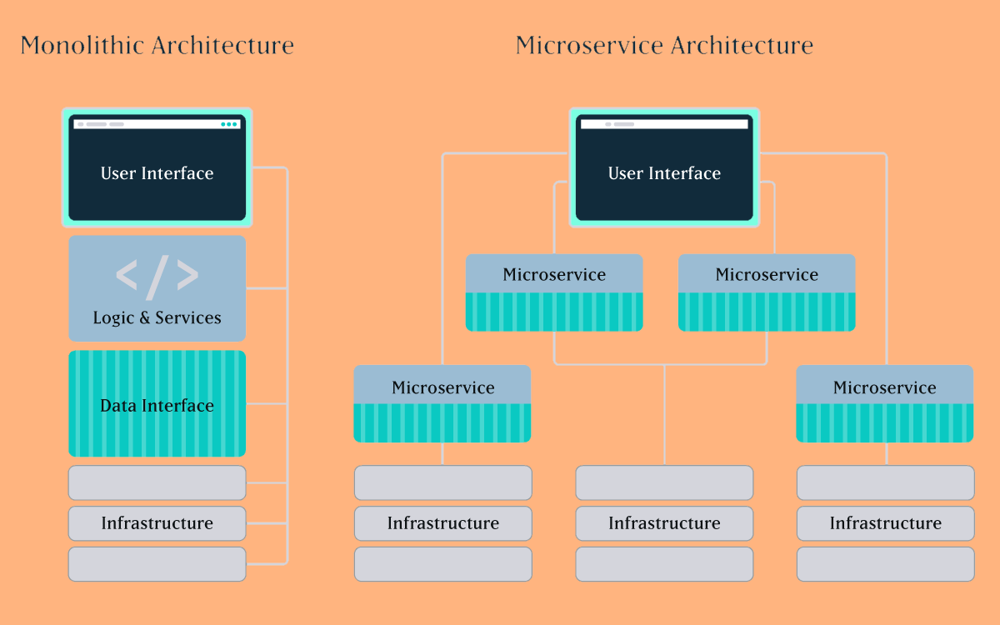

**012** **Архитектурный стиль –** **Microservices.**

 

Статус – accepted (принят).

 

Контекст:

Рассмотрены предложения архитектурных стилей монолит или микросервис. 

*(010 Анализ и описание архитектурных опций и обоснование выбора)*.

 

**Решения:**

**Будем использовать** Архитектурный стиль – Microservices**.**

Причины принятия решения:

Архитектурный стиль – Монолит не соответствует пункту 8 НФТ, при увеличении нагрузки в монолите придется поднимать несколько монолитов, при микросервисной архитектуре мы можем поднять дополнительно только наиболее загруженные сервисы.

Последствия:

**Увеличивается общая сложность разработки. Разделение проекта на сервисы упрощает работу команд разработчиков над отдельными модулями проекта. Вместе с тем повышаются требования к взаимодействию.**

 

Комплаенс (проверка соответствия):

**Необходима разработка сценариев тестирования взаимодействия модулей системы.**

**Заметки:**

ИТ архитектор Драчёв О.Е. 14.03.2022.
