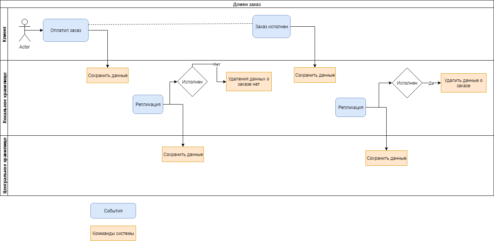
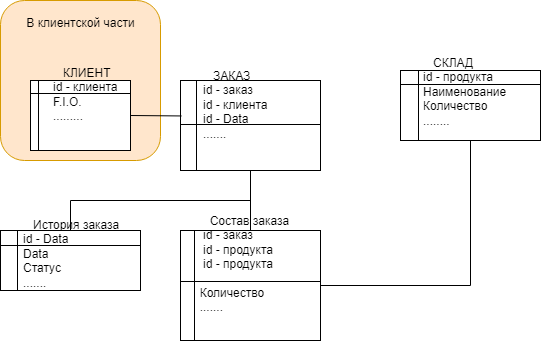

### 014 Хранение данных

 

Статус – accepted (принят).

 

Контекст:

Наша компания работает в различных регионах мира.

В результате работы активных клиентов формируется много клиентской информации. При хранении данных в едином хранилище возникает проблема передачи данных из различных регионов мира.

 

**Решения:**

**Организовать региональные хранилища клиентских данных****.** Данные домена заказ будем хранить в региональном хранилище, а также передаваться в центральное хранилище. 

Региональные хранилища данных хранят данные только не закрытых заказов, после получения статуса «заказ исполнен» и репликации – данные заказа из локального хранилища удаляется – остается только запись заголовка заказа.  

 

Локальные и центральные базы данных объединены в одну виртуальную базу данных. Данные организованы по типу снежинка. 

Причины принятия решения:

Экономия размера локального хранилища данных (одна из самых высоких статей затрат в облачных услугах). Для повышения надежности хранения данных - бизнес данные о заказах хранятся в 2х хранилищах.

 

Последствия:

**Синхронизация коммерческих данных в 2х хранилищах повысит надежность системы.**

 

Комплаенс (проверка соответствия):

**Провести тестовую выборку данных из различных хранилищ и сравнить их.** 

 

**Заметки:**

ИТ архитектор Драчёв О.Е. 14.03.2022.