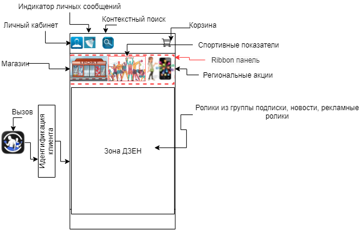
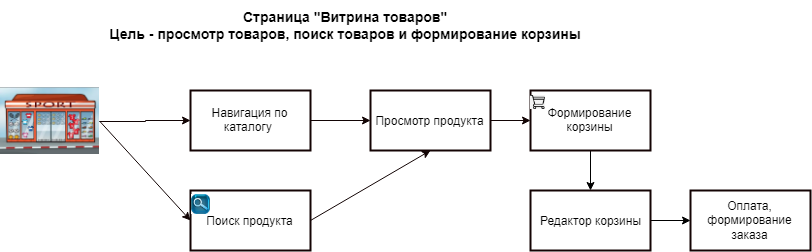
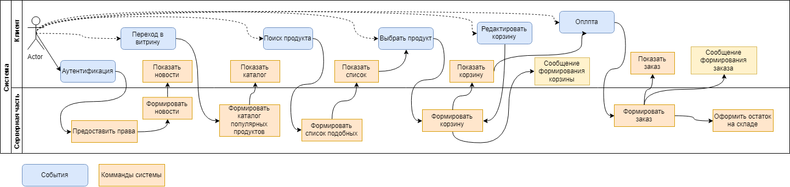
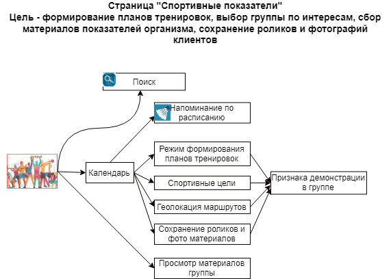
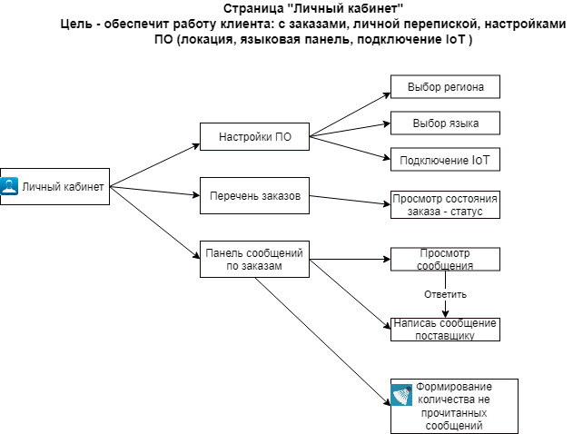
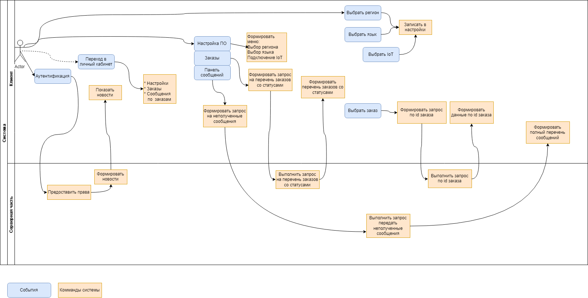
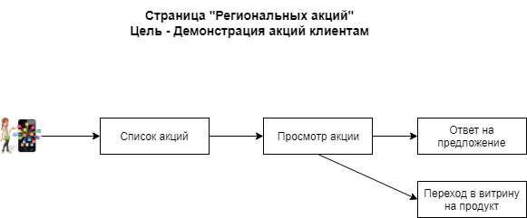
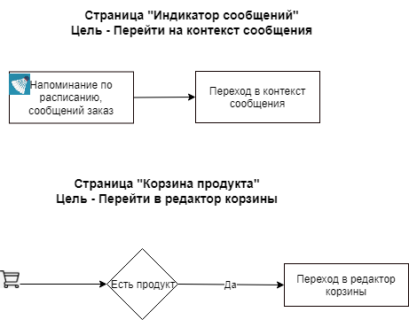

####  **012 **Описание сценариев использования приложения.

 

Статус – accepted (принят).

 

Контекст:

Определение форм приложения.

​      **Стартовая страница приложения**

​     Цель - увидеть состояние окружения и личной переписки.

На схеме *(ниже)* приведена типовая схема работы системы.

Перечень событий и команд при работе с личным кабинетом *(некоторые связи* *Actor* *– событие не указаны для лучшей читаемости схемы)*.

**Решения:** 

Принять за основу выше приведенные предложения.

 

Причины принятия решения:

​      Достижение бизнес целей.

 

Комплаенс (проверка соответствия):

​      Еженедельное подведение итогов разработка и демонстрация результатов.

 

**Заметки:**

ИТ архитектор Драчёв О.Е.  26.07.2022.