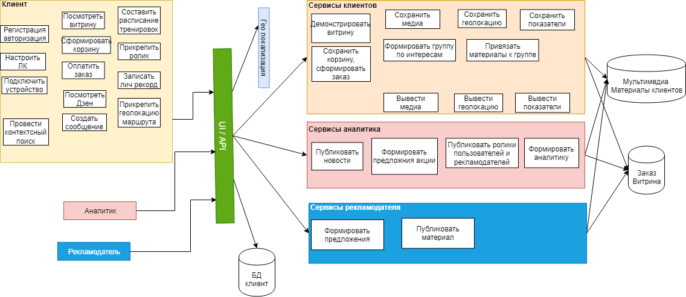
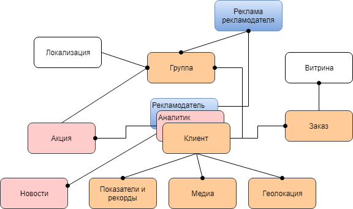
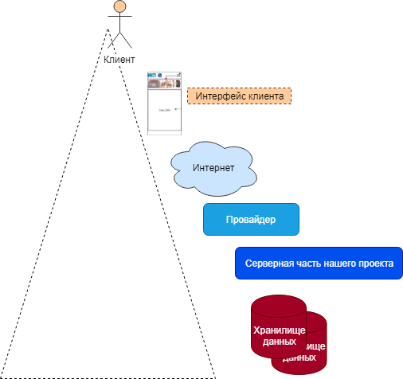
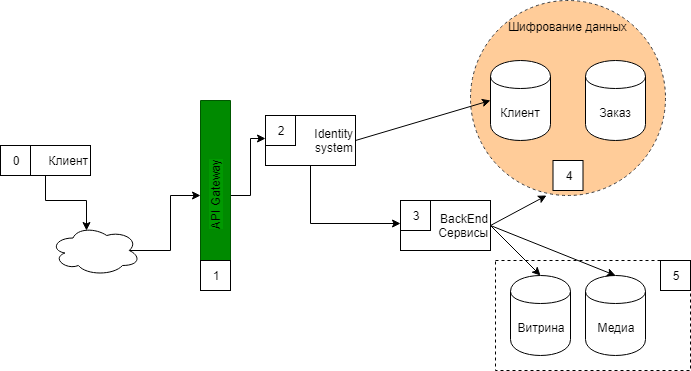

14. ###  Основные представления 

a.  Функциональное. 

В схеме описаны основные функции пользователей системы. Не показаны функции бак-энда, в части разделения доступа к информации и т.д.

b.  Информационное.

Информационная модель основана на потоках данных пользователь. В центре схемы находится клиент-рекламодатель. Рекламодатель использует данные медиа и геолокации совмесно с клиентом. Аналитик использует статистические данные по заказам и активность клиентов в группах.

c.  Многозадачность (concurrency).

.png)

На схеме многозадачности представлена схема серверной части системы на основе Kubernetes.

Клиентская часть ПО передает свои запросы в очереди серверной части. API Gateway на схеме не рассмотрен. Схеме представлена с уровня микросервисов пользовательского функционала.

 d.  Инфраструктурное.

На вершине схемы находиться клиент, который работает с интерфейсом клиентского ПО. ПО клиента через интернет и поты провайдера обращается к серверной части ПО. Серверное ПО работает с хранилищем данных. Вся схема опирается на электросети (на схеме не показаны).

e.  Безопасность. 

| **Элементы системы** | **№ вектора** | **Возможные векторы атак**                                   | **Способы защиты от векторов атак**                          |
| -------------------- | ------------- | ------------------------------------------------------------ | ------------------------------------------------------------ |
| 0,1                  | 1             | 1.  Инъекции — Injections                                    | · Использование более безопасного API, исключающего использование  интерпретатора.  · Использование параметризованных запросов при кодировании.  · Отделение команд от данных во избежание атак. |
| 0,1                  | 2             | Sensitive  Data Exposure (незащищённость конфиденциальных данных) | ·      Используя защищённый URL.  ·      Использование надёжных и уникальных  паролей.  ·      Шифрование всей конфиденциальной  информации, которую необходимо сохранить. |
| 0,3                  | 3             | XML  External Entities (XXE) Insecure Deserialization (внешние сущности XML,  небезопасная десериализация) | ·     Использование менее сложных  форматов данных, таких как JSON.  ·     Обновление процессоров  и библиотек XML.  ·     Использование инструментов SAST. |
| 2                    | 4             | Broken  Access Control (нарушение контроля доступа)          | ·      Удаление аккаунтов, которые больше  не нужны или неактивны.  ·      Отключение ненужных служб для  снижения нагрузки на серверы.  ·      Использование тестирования на  проникновение. |
| Вся система          | 5             | Небезопасная  конфигурация (Security Misconfiguration)       | ·      Использование динамического  тестирования безопасности приложений (DAST).  ·      Отключение использования паролей  по умолчанию.  ·      Следите за облачными  ресурсами, приложениями и серверами. |
| 0,1                  | 6             | Межсайтовый скриптинг – XSS  (Cross Site Scripting)          | ·      Использование соответствующих  заголовков ответа.  ·      Фильтрация ввода  и кодирование вывода.  ·      Использование политики  безопасности контента.  ·      Применение подхода с нулевым  доверием к пользовательскому вводу. |
| 2                    | 7             | Broken  Authentication (нарушенная аутентификация)           | ·       Реализация многофакторной  аутентификации.  ·       Защита учётных данных  пользователя.  ·       Отправка паролей через  зашифрованные соединения. |
| 0,2,3                | 8             | Использование компонентов с известными  уязвимостями         | ·      Удаление всех ненужных  зависимостей.  ·      Использование виртуального  исправления.  ·      Использование компонентов только  из официальных и проверенных источников. |
| 3                    | 9             | Небезопасная  десериализация                                 | ·      Внедрение цифровых подписей.  ·      Использование тестирования  на проникновение.  ·      Изоляция кода, который  десериализует, и запуск его в средах с низким уровнем  привилегий для предотвращения несанкционированных действий. |
| Вся система          | 10            | Недостаточное  ведение журнала и мониторинг                  | ·      Внедрение программного обеспечения  для ведения журналов и аудита.  ·      Создание эффективной системы  мониторинга.  ·      Думайте, как злоумышленник  и используйте метод проверки на проникновение. |
